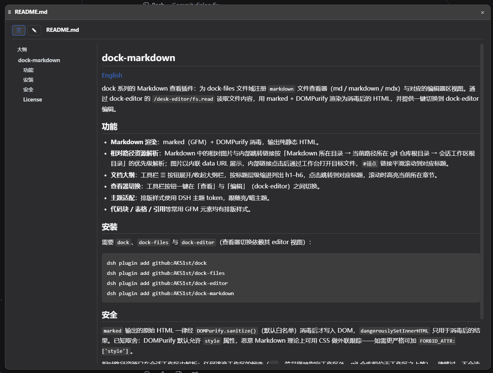

# dock-markdown

[中文](README.md)

> **The best Markdown viewer plugin in the DSH ecosystem — no contest.** GFM rendering, DOMPurify sanitization, a document outline, relative image/link resolution and one-click switch to editing — for READMEs, docs or drafts, dock-markdown gives Markdown an editor-grade experience in DSH for the first time.

Markdown viewer plugin of the dock family: registers the `markdown` file viewer (md / markdown / mdx) against the dock-files file domain plus the matching editor-area view. File content is read through dock-editor's `/desk-editor/fs.read` route, rendered with marked + DOMPurify into sanitized HTML, with a one-click switch to editing in dock-editor.

## Preview



## Features

- **Markdown rendering**: marked (GFM) + DOMPurify sanitization, output is static HTML only.
- **Relative asset resolution**: relative images and internal file links in Markdown resolve with the priority Markdown directory → git repository root of the current path → session workspace root; images are inlined as data URLs, internal links open the target through the workbench on click, and `#anchor` links smooth-scroll to the matching heading.
- **Document outline**: the toolbar ☰ button toggles an outline rail listing h1–h6 indented by level; clicking an entry jumps to the heading, and scrolling highlights the section currently in view.
- **Viewer switch**: toolbar button switches between view and edit (dock-editor) in one click.
- **Theme aware**: typography uses DSH theme tokens and follows light/dark themes.
- **Common GFM elements** (code blocks, tables, blockquotes, ...) get styled typography.

## Dependencies

| Dependency | Type | Notes |
| --- | --- | --- |
| [dock](https://github.com/AKS1st/dock) >= 0.1.0 | peer (required) | workbench shell: the editor-area view, floating windows and `ctx.workbench` come from it |
| [dock-files](https://github.com/AKS1st/dock-files) >= 0.1.0 | peer (required) | file-domain service: dock-markdown is dispatched as the `markdown` viewer |
| [dock-editor](https://github.com/AKS1st/dock-editor) >= 0.1.0 | peer (required) | provides `/desk-editor/fs.read` for file content and the editor view that the one-click switch opens |
| DSH Web environment | runtime | required; client platform is Web |
| `cordis` ^4.0.0-rc.7 | peer | plugin framework (ships with DSH) |
| `react` ^18.2.0 | peer (optional) | needed for client rendering; without it the viewer UI does not activate |
| `marked` / `dompurify` | bundled (build-time) | GFM rendering and sanitization; shipped with the plugin, no separate install needed |

## Install

Requires `dock`, `dock-files` and `dock-editor` (the view switch opens its editor view):

```sh
dsh plugin add github:AKS1st/dock
dsh plugin add github:AKS1st/dock-files
dsh plugin add github:AKS1st/dock-editor
dsh plugin add github:AKS1st/dock-markdown
```

## Security

All raw HTML produced by `marked` passes through `DOMPurify.sanitize()` (default allowlist) before touching the DOM; `dangerouslySetInnerHTML` is only used on sanitized output. Known trade-off: DOMPurify's defaults allow the `style` attribute, so a malicious Markdown file could in theory use CSS for external tracking — add `FORBID_ATTR: ['style']` if you need stricter sanitization.

Relative assets are resolved only inside the session workspace: any candidate that escapes the workspace (`..`, a symlink pointing out, a git repo root above the workspace, ...) is skipped and never read.

## License

MIT
